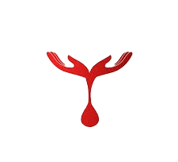
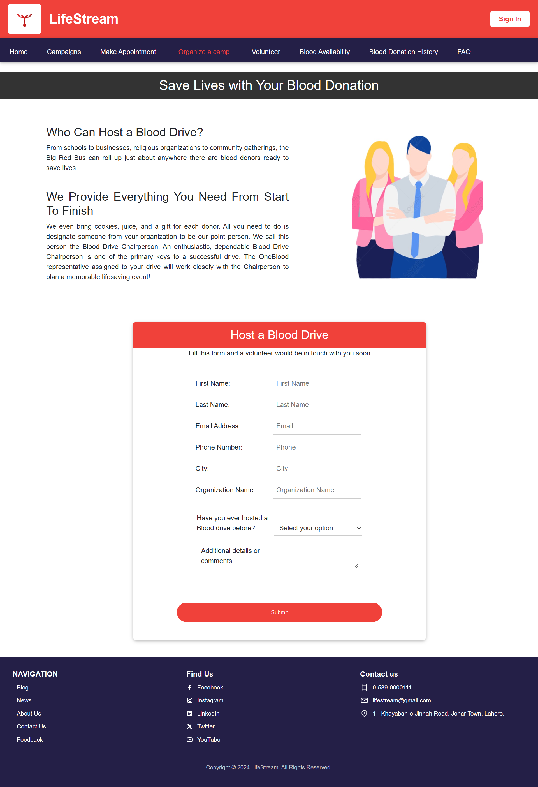

# LifeStream - Blood Donation Management System

  
  <h3>Connecting Hearts, Saving Lives</h3>
  
A comprehensive web-based blood donation management platform designed to streamline the blood donation process and connect donors with those in need.

---

## 🌐 Live Preview

🚀 **View the Project Live:**  
👉 [https://life-stream-websites-frontend.vercel.app/](https://life-stream-websites-frontend.vercel.app/)  

⏳ *Please wait 10–15 seconds for the website to fully load — the free hosting may cause a slight delay.*

---

## 📸 Project Screenshots

Below are some key pages from the **LifeStream** website interface:

 **Page Preview** 

 🏠 **Home Page** 
  
 🎯 **Campaigns** 
  
 📅 **Make Appointment**  
  
 🩸 **Organize a Camp**  
  
 🙋‍♂️ **Volunteer Registration** 
  
 🔍 **Blood Availability** 
  
 🧾 **Donation History**
  
 ❓ **FAQ** 
  
 🔑 **Sign In** 
  
 🆕 **Sign Up** 
  

---

## 🌟 Overview

LifeStream is a modern, responsive web application that facilitates blood donation management and awareness. Built as part of the **Business Process Engineering** curriculum, this platform serves as a bridge between blood donors, recipients, and healthcare organizations, making the donation process more efficient and accessible.

---

## ✨ Features

### 🏠 **Core Functionality**
- **User Registration & Authentication** – Secure sign-up and sign-in system  
- **Blood Availability Search** – Real-time blood type and location-based search  
- **Appointment Scheduling** – Easy booking system for donation appointments  
- **Donation History Tracking** – Comprehensive donor activity records  
- **Eligibility Checker** – Interactive tool to determine donation eligibility  

### 🎯 **Community Features**
- **Campaign Management** – Organize and promote blood drive campaigns  
- **Volunteer Registration** – Platform for community volunteers  
- **News & Updates** – Latest information about blood donation drives  
- **Educational Blog** – Informative articles about blood donation  
- **FAQ Section** – Comprehensive answers to common questions  

### 📞 **Support & Engagement**
- **Contact System** – Multi-channel communication options  
- **Feedback Collection** – User experience improvement system  
- **About Us** – Detailed information about the organization  

---

## 🚀 Technologies Used

- **Frontend:** HTML5, CSS3, JavaScript  
- **Styling:** Bootstrap 4.3.1, Material Design Bootstrap (MDB)  
- **Icons:** Font Awesome 5.8.2  
- **Fonts:** Open Sans (Google Fonts)  
- **Media:** Responsive images and video content  

---

## 📁 Project Structure
LifeStream-Project/
├── HTML Pages/
│   ├── About-Us.html
│   ├── Appointment.html
│   ├── Blog.html
│   ├── BloodAvailability.html
│   ├── Campaigns.html
│   ├── Contact-Us.html
│   ├── Donation-Eligibility-Checker.html
│   ├── DonationHistory.html
│   ├── FAQ.html
│   ├── Feedback.html
│   ├── News.html
│   ├── Organize-Camp.html
│   ├── Sign-In.html
│   ├── Sign-Up.html
│   ├── Volunteer.html
│   └── index.html
├── Assets/
│   ├── css/
│   │   └── style.css
│   ├── images/
│   │   ├── icon.png
│   │   └── screenshots/
│   ├── javascript/
│   │   └── form.js
│   └── video/
│       └── mission-video.mp4
└── README.md

---

## 💻 Usage Guide

### 🩸 **For Donors**
1. **Register** – Create an account via the Sign-Up page  
2. **Check Eligibility** – Use the eligibility checker before donating  
3. **Book Appointment** – Schedule a convenient donation time  
4. **Track History** – Monitor your donation contributions  

### ❤️ **For Recipients**
1. **Search Blood** – Find available blood types in your area  
2. **Contact Centers** – Reach out to blood banks directly  
3. **Stay Updated** – Follow campaigns and availability updates  

### 🏥 **For Organizations**
1. **Organize Campaigns** – Create and manage blood drive events  
2. **Manage Volunteers** – Coordinate community support  
3. **Update Information** – Keep blood availability current  

---

## 🎨 Design Features

- **Responsive Design** – Works seamlessly across all device sizes  
- **Modern UI/UX** – Clean, intuitive interface with Material Design  
- **Accessibility** – User-friendly navigation and clear visual hierarchy  
- **Performance Optimized** – Fast loading times and efficient code  
- **Cross-Browser Compatible** – Consistent experience across browsers  

---

## 🤝 Contributing

We welcome contributions to improve LifeStream! Here's how you can help:

1. **Fork** the repository  
2. **Create** a feature branch (`git checkout -b feature/AmazingFeature`)  
3. **Commit** your changes (`git commit -m 'Add some AmazingFeature'`)  
4. **Push** to the branch (`git push origin feature/AmazingFeature`)  
5. **Open** a Pull Request  

### Contribution Guidelines
- Follow existing code style and structure  
- Ensure responsive design principles  
- Test across multiple browsers  
- Update documentation as needed  

---

## 📧 Contact & Support

- **Name:** Abdul Wahab Subhani  
- **Email:** [abdulwahabsubhani2003@gmail.com]  
- **Issues:** Please report bugs and feature requests via the contact form  

---

## 📄 License

This project is created for educational purposes. Feel free to use or modify it as you like.

---

## 🔮 Future Enhancements

- [ ] Mobile application development  
- [ ] Real-time notifications system  
- [ ] Integration with hospital management systems  
- [ ] Advanced analytics and reporting  
- [ ] Multi-language support  
- [ ] Payment gateway for donations  
- [ ] SMS/Email notification system  
- [ ] API development for third-party integrations  

---

  
<strong>LifeStream - Every Drop Counts, Every Life Matters</strong>

  
Built with ❤️ for the community

